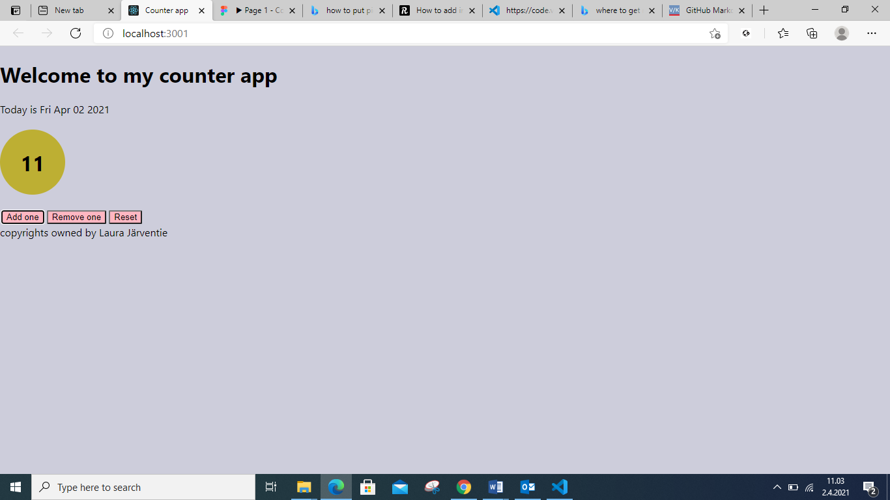

# Counter app to calculate/remove

School exercise for React.js When you press add, it adds one to counter. Remove removes 1 (until 0). 0, oddd and even numbers have their own color. Clear sets counter to 0.

Please note all the pages where I have been when looking information how to add picture to ReadMe. So I really made the effort... ;D

this is how it looks like:

Format: .png 
